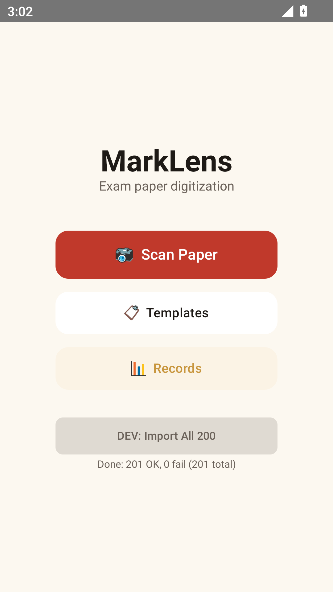
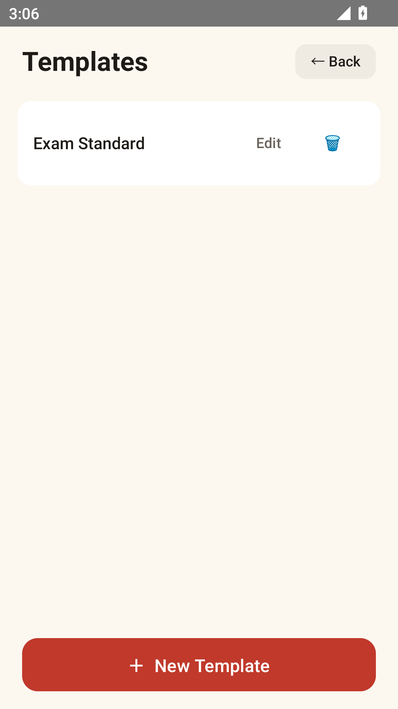
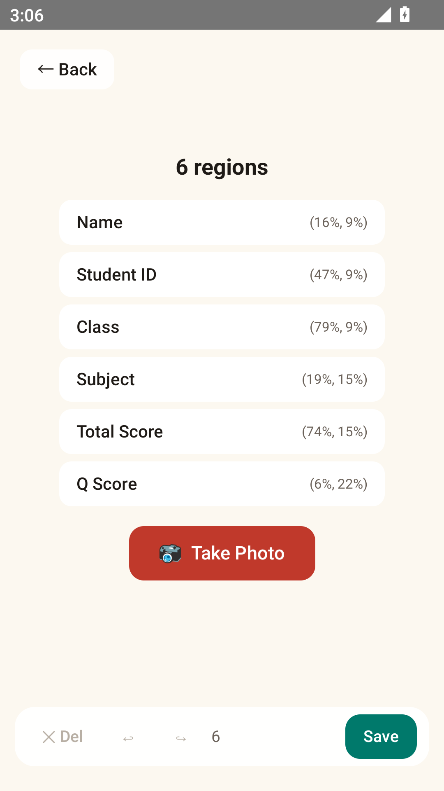
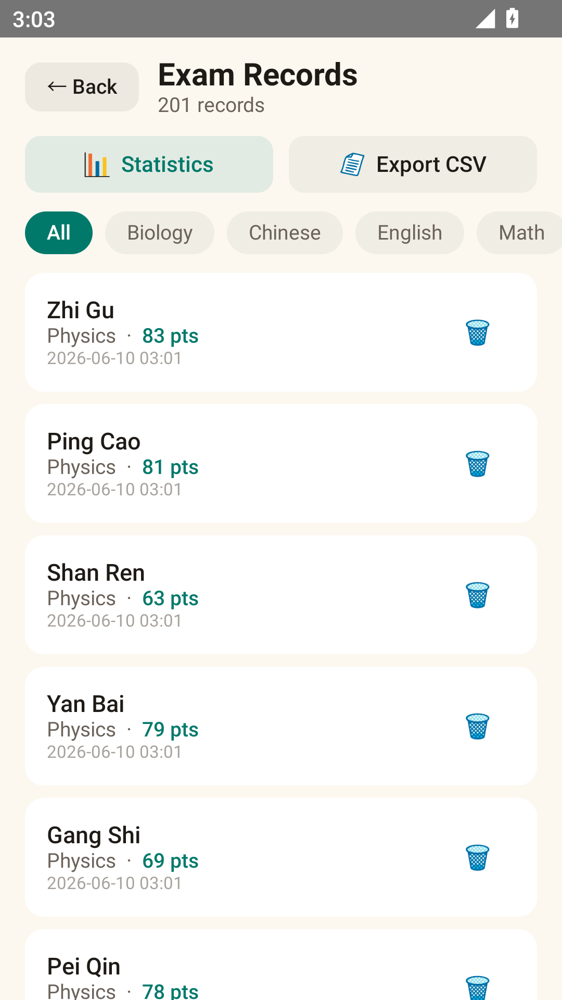
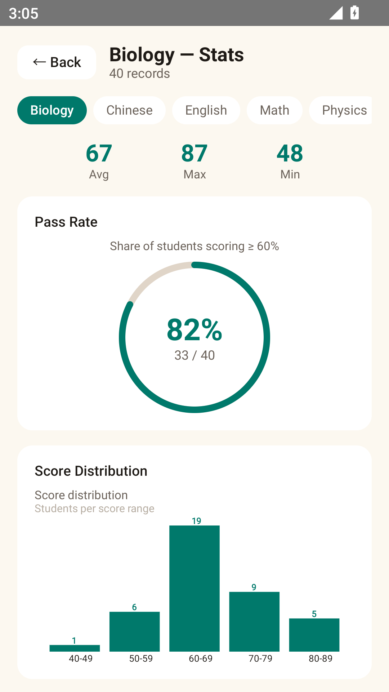
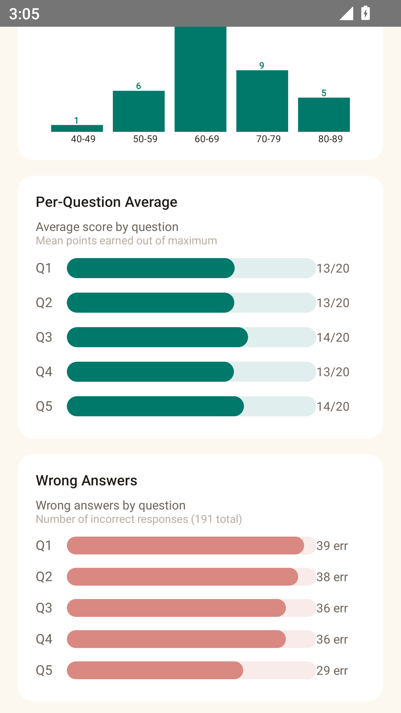
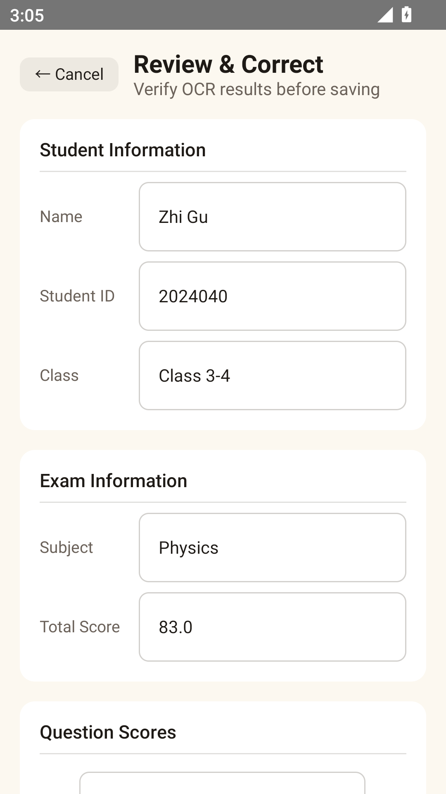
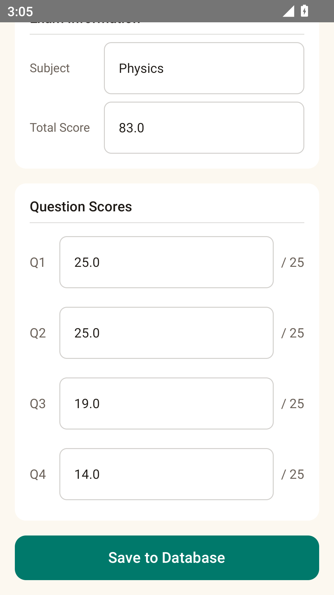

# MarkLens

> Exam paper digitization — photograph, extract, analyze.

MarkLens lets teachers digitize paper exam results by photographing sheets,
extracting student info and scores via OCR, and reviewing statistics.

## Features

- **Template-based scanning** — Define regions once, reuse for every paper with the same layout
- **Full-page OCR** — Google ML Kit on-device recognition with spatial block mapping
- **Pluggable OCR** — `OcrProvider` interface, swap in Cloud Vision for handwriting
- **Review & correct** — Verify OCR results before saving to database
- **Statistics dashboard** — Score distribution, pass rate, per-question analysis
- **CSV export** — Share exam records as CSV via system share sheet
- **Room database** — Persistent local storage

## Screenshots

| Home | Templates | Template Editor |
|------|-----------|-----------------|
|  |  |  |

| Records | Statistics | Statistics Charts |
|---------|------------|-------------------|
|  |  |  |

| Review (Info) | Review (Scores) |
|---------------|-----------------|
|  |  |

## Architecture

```
Home ──→ Scan Paper ──→ Template Picker ──→ Gallery Photo
                            │                    │
                            ▼                    ▼
                       Template Regions ──→ Full-page OCR (ML Kit)
                                                 │
                                                 ▼
                                          RegionMapper (spatial)
                                                 │
                                                 ▼
                                          ScoreParser + StudentInfoParser
                                                 │
                                                 ▼
                                          Review Screen (verify/correct)
                                                 │
                                                 ▼
                                          Room Database
                                                 │
                                        ┌────────┴────────┐
                                        ▼                  ▼
                                    Records            Statistics
```

## Screens

| Screen | Purpose |
|--------|---------|
| Home | Entry — Scan Paper, Templates, Records |
| Templates | Manage templates (create / edit / delete) |
| Editor | Photo + region drawing + labels → save template |
| Review | Verify/correct OCR results → save to DB |
| Records | Saved exam records, subject filter, CSV export |
| Stats | Score distribution, pass rate, per-question, error heatmap |

## Quick Start

```bash
git clone https://github.com/FrozenYty/marklens.git
cd marklens
./gradlew assembleDebug
./gradlew installDebug      # needs emulator or device
```

Requirements: JDK 21, Android SDK 36+, Gradle 9.4.1

## Testing with Sample Papers

Generate 200 sample exam papers for OCR testing:

```bash
python generate_papers.py   # outputs to test-papers/
adb push test-papers/ /sdcard/Pictures/MarkLens-Test/
```

## Tech Stack

| Layer | Technology |
|-------|-----------|
| UI | Jetpack Compose + Material 3 |
| OCR | Google ML Kit (swappable via OcrProvider) |
| DB | Room 2.8 |
| Camera | Gallery picker |
| Image | Coil (AsyncImage) |
| Lang | Kotlin 2.3 |

## Team

| Name | GitHub | Role |
|------|--------|------|
| Tianyu Yao | [FrozenYty](https://github.com/FrozenYty) | Lead |
| Jianheng Sun | [chemflowers](https://github.com/chemflowers) | Developer |

## Limitations

This is an exploratory prototype, not production-ready software.

| Limitation | Detail |
|-----------|--------|
| **Printed text only** | ML Kit on-device recognition handles printed/typed text well but cannot reliably recognize handwritten characters. Handwritten scores are the most common case in real exam papers. |
| **Fixed framing required** | Template regions use normalized coordinates. The scan photo must be framed similarly to the template photo — different angles, rotations, or crops will misalign regions. |
| **No auto-alignment** | No perspective correction or document edge detection. The user must frame the paper squarely. |
| **Gallery only** | No live camera preview (CameraX was removed). Photos must be taken separately and selected from gallery. |
| **Single language** | OCR uses the Latin script recognizer. Chinese/Japanese/Korean exam papers need a different ML Kit model. |
| **No cloud sync** | All data is local (Room). No backup, no multi-device sync. |
| **No batch scanning** | One paper at a time. No "scan next" workflow for processing a stack of papers. |

## Future Work

| Direction | Approach |
|-----------|----------|
| **Handwriting OCR** | Integrate Google Cloud Vision API or a custom ML model (e.g., TrOCR) via the existing `OcrProvider` interface. The architecture already supports pluggable providers. |
| **Auto-alignment** | Add OpenCV-based perspective transform to correct skewed photos before OCR. Detect paper edges automatically. |
| **Live camera** | Re-integrate CameraX with real-time edge detection overlay to guide framing. |
| **Batch processing** | Add a "scan next" loop that stays in the scan flow after saving, letting teachers process an entire stack without returning to home. |
| **Cloud sync** | Add Firebase/Supabase backend for backup and multi-device access. |
| **Multi-language** | Support Chinese script recognition via ML Kit's Chinese model or Cloud Vision. |
| **Export formats** | Beyond CSV: generate PDF reports, integrate with LMS platforms (Moodle, etc.). |
| **AI-assisted grading** | Use LLM to evaluate free-text answers, not just extract scores from pre-graded papers. |

This project serves as a foundation for exam digitization tools. The modular architecture
(pluggable OCR, template-based regions, MVVM + Repository) makes it straightforward to
extend with more sophisticated recognition and analysis capabilities.

## License

MIT
